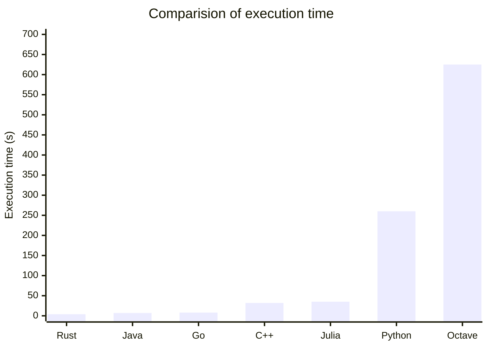

# Genetic Algorithm

This repository contains an implementation of the Genetic Algorithm to solve the 0-1 knapsack problem using different programming languages. This implementation of the Genetic Algorithm makes use of the following features:

* Roulette wheel selection
* Single point crossover
* Bit flip mutation

And is currently implemented in the following languages:

* C++
* Go
* Java
* Julia
* Matlab/Octave
* Python
* Rust

Refer to the instructions present within individual folders for each language to run the code.

## Comparision of execution time

The following execution times were achieved for the different programming languages tested in this repository across all the datasets when run on a computer with an Intel i7 4700MQ processor with 16 GB RAM:

| Language  | Execution time (s) |
| :------------- | :------------- |
| Rust | 4 |
| Java | 7 |
| Go | 8 |
| C++ | 32 |
| Julia | 35 |
| Python | 260 |
| Octave | 625 |

